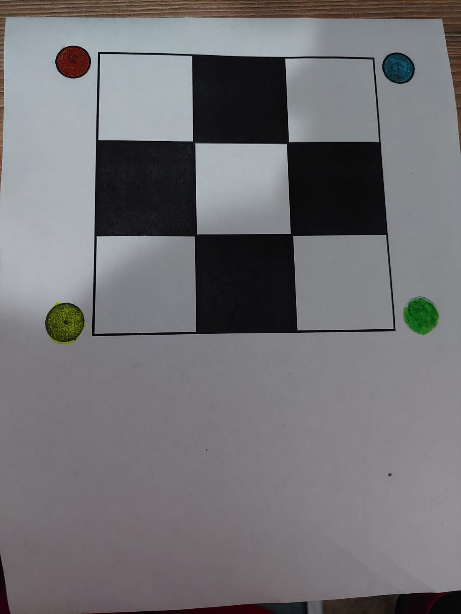
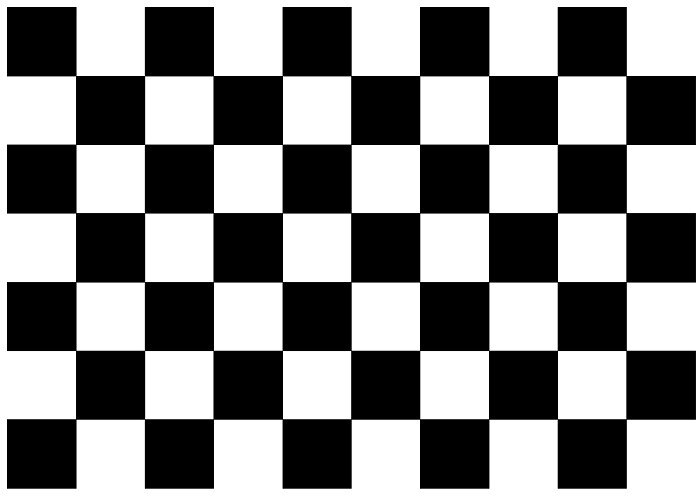
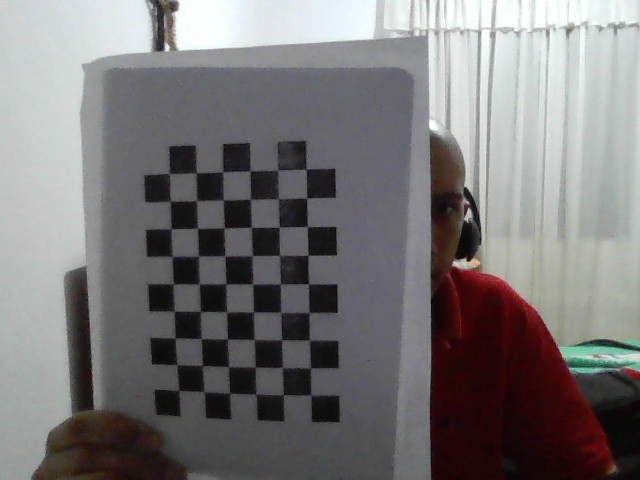
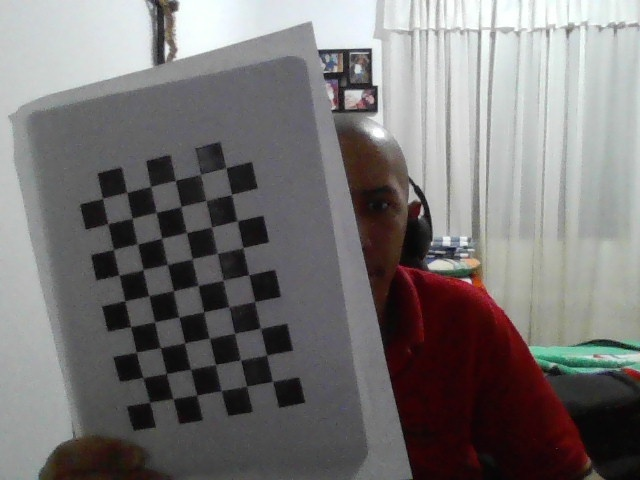
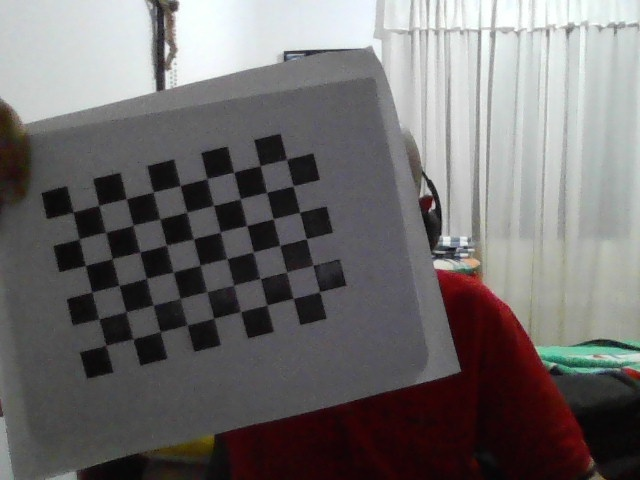
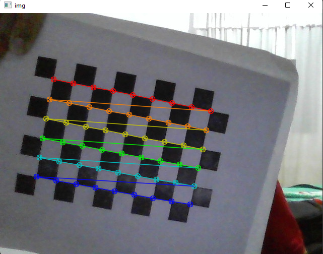
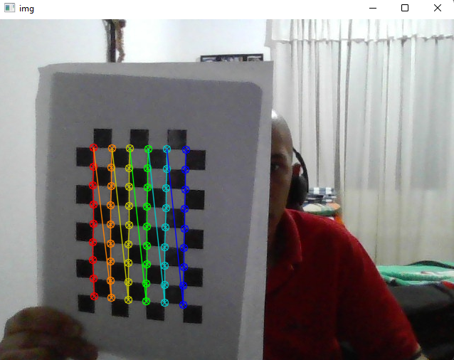
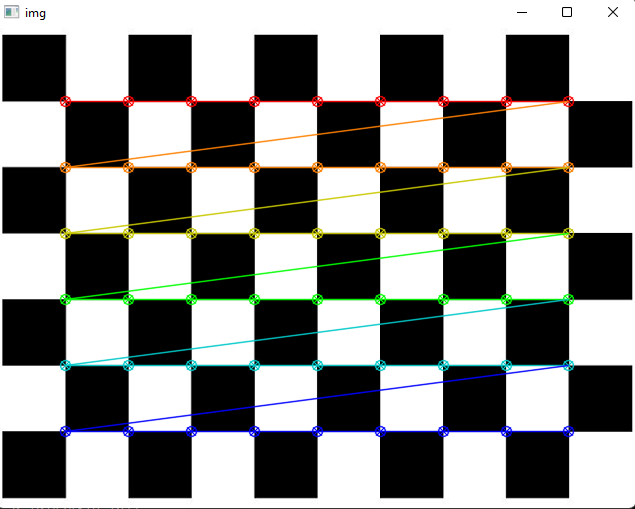
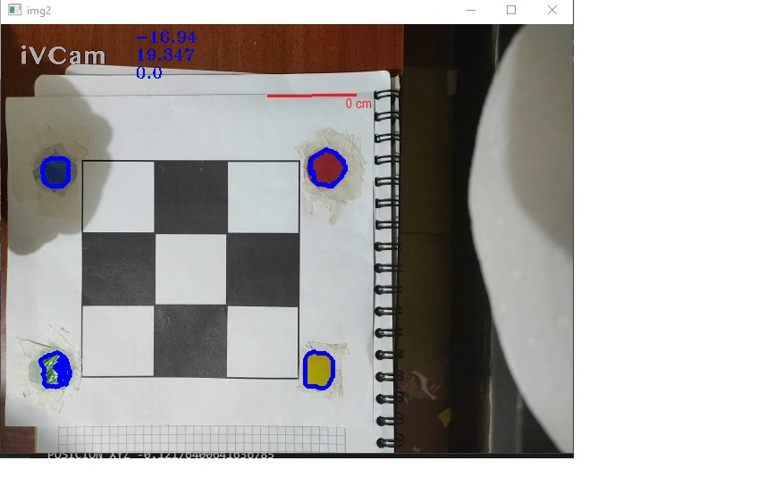
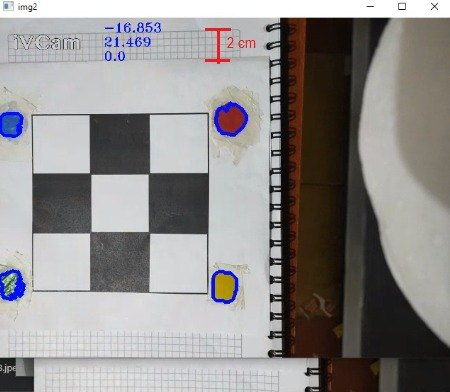

# ProyectoFinalRobotica

### Herramientas

### Pasos de ejecución

- Primero se debe correr el archivo capturarImagenes.py. Es necesario configurar la ruta de la carpeta donde se encuentra el proyecto. 
Este codigo se encarga de capturar las imagenes del tablero de ajedrez que serviran para el proceso de calibracion de la camara. 
Sugerencia: tomar alrededor de 15 imagenes con diferentes angulos para un proceso de calibracion de mayor calidad.

##### En el archivo calibracion.py tambien es necesario cambiar la ruta de la carpeta en donde se encuentra el proyecto.

- Luego se debe de correr el archivo main.py , este se encarga de ejecutar el proceso de calibración de la camara como se observa en las siguientes imagenes.

- Posteriormente ya se encuentra listo para realizar la detección del triqui a travez de los circulos alredor del triqui que serviran como objeto patron para detectar la poscion de este en el "mundo real" con sus respectivas coordenadas XYZ.

#### Herramientas de ayuda

- El archivo tester.py nos sirve para hallar las mascaras de los colores usados para detectar la posicion del patron, este sera de ayuda en caso de que se quiera usar otro color, teniendo en cuenta que se deben hacer ciertas modificaciones en el codigo.
